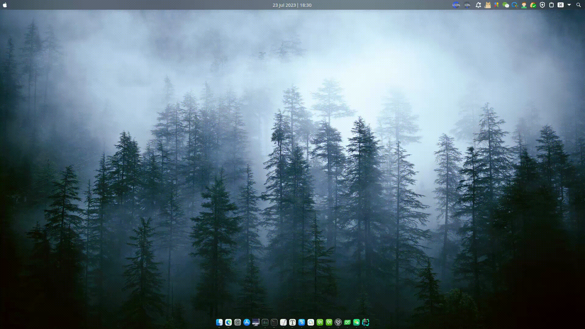

# kde-wine-helper

一个小工具，用于解决KDE上由于wine微信/企业微信来新消息时图标不显示/不闪烁导致无法知晓新消息是否到来的问题。

效果：


## 安装编译依赖
在archlinux上可以这样安装：
```shell
# 安装gcc等工具
sudo pacman -S gcc gdb cmake extra-cmake-modules

# 安装qt-base:
sudo pacman -S qt5-base 

# 安装kwindowsystem
sudo pacman -S kwindowsystem
```

## 编译
```shell
rm -rf build
mkdir build
cd build
cmake ..
make
```

## 配置文件说明
```json
[
  {
    // 微信窗口的名称。本工具根据这个窗口名称来识别微信窗口
    "windowName": "WeChat",
    // 新消息到来时是否自动切换到微信窗口
    "autoActivateWindow": false,
    // 新消息到来时是否弹出托盘通知
    "showTrayNotify": true,
    // 微信托盘图标
    "trayIcon": "./icons/wechat.png",
    // 托盘通知的标题
    "notifyTitle": "微信",
    // 托盘通知的内容
    "notifyContent": "你有新的微信消息",
    // 托盘通知的展示时长
    "showTrayNotifyDurationInSeconds": 15
  },
  {
    // 企业微信窗口的名称。本工具根据这个窗口名称来识别企微窗口
    "windowName": "企业微信",
    "autoActivateWindow": false,
    "showTrayNotify": true,
    "trayIcon": "./icons/wxwork.png",
    "notifyTitle": "企业微信",
    "notifyContent": "你有新的企微消息",
    "showTrayNotifyDurationInSeconds": 60
  }
]
```

## 注意
1.此工具基于KWindowSystem的窗口状态变更信号：当新消息到来时，微信/企业微信的窗口的属性会
被设置为`DemandsAttention`，本工具侦听到这个信号后通过桌面消息、自行绘制闪烁的托盘图标等方式提醒用户。
这种实现方式可能存在一个问题：如果微信/企业微信窗口关闭，则无法侦听到是否有新消息到来。
因此，**建议不要关闭微信/企微窗口，改用最小化窗口来代替！**

2.此工具支持X11环境，可能不支持Wayland（我没试过，因为wine对Wayland的支持还不是很好，所以我依旧使用X11）。

3.此工具会自行绘制微信/企微的托盘图标。如果向我一样有强迫症，可以通过`System Tray Settings`自行把wine创建的托盘图标隐藏。

4.使用者需要根据自己的情况修改`config.json`中的`windowName`，以确保和自己的微信/企微的窗口名一致。窗口名可直接通过`latte-dock`的提示得知，也可以通过`wmctrl -l `命令查看。